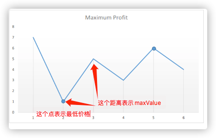

# 动态规划问题相关核心思想和代码
## LeetCode-123-背包问题
   - 核心思想：res = max(选择装的收益, 选择不装的收益)
   - 核心代码：todo 贴图

## LeetCode-70-爬楼梯：res = (选择爬1，选择爬2)：
   - 操作和状态
     - 操作：爬1个阶梯、爬两个阶梯
     - 状态：无状态？爬楼梯的组合数？
## LeetCode-322-凑零钱：
   - 操作和状态
     - 操作：不兑换、兑换1块钱、兑换2块钱、兑换....第i个硬币
     - 状态：总的兑换次数？无状态？
   - 自底向上：从amount=1开始计算兑换，f(10)=min(f(8+兑换2块钱),f(7+兑换1块钱),....)+1
   - res = min(不兑换, 兑换1， 兑换2， 兑换3)
   - 自顶向下：递归计算，从目标金额开始算，f(10) = f(10-coin) + 1
   - 
## LeetCode-198-打劫问题：
   - 操作和状态：
     - 操作：不打劫、打劫
     - 状态：无状态?总的收益和
   - 自底向上：数组解决，从第一个房子开始，res = max(打劫收益, 不打劫收益)；后面的状态依赖前面的状态
   - 
## LeetCode-64-最小路径和
   - 核心思想：
     - 操作和状态：
       - 操作：向左边发展、向右边发展
       - 状态：（无状态？）总的路径和
     - res = min(选择左边，选择右边) + res
       - 自底向上：从第一个格子开始，就地更新当前节点的最小路径和
       - 类似打劫，打劫第一个或者第二个
   - 

## LeetCode-1884-鸡蛋掉落-两枚鸡蛋
   - 核心思想：
   - 操作和状态：
     - 操作：扔鸡蛋一种操作
     - 状态：鸡蛋碎了、鸡蛋没碎
     - 结果：总的操作次数
   - // 全部操作情况：从第1层开始扔, 从第2层开始扔.....从第i层开始扔
     // 取最小操作次数：res = min(从第1层开始扔, 从第2层开始扔.....从第i层开始扔)
     // 每次扔有2种状态：最坏的情况 = max(碎了, 没碎）
     // ① 碎了： 转化为 (k - 1)次1个鸡蛋慢慢试了 + 本次操作1 f(i) = 1 + k -1 = k
     // ② 没碎： 转化为 (i-k)次最小操作次数子问题 f(i) = f(i-k) + 1
   - 综上：res = min( max(1, dp[n-1]+1), max(2, dp[n-2]+1),  max(3, dp[n-3]+1), max(4, dp[n-4]+1).....)

## LeetCode-121-买卖股票的最佳时机I
   - 核心思想：
   - 

## LeetCode-122-买卖股票的最佳时机II
   - 核心思想：
   - 操作和状态：
     - 状态：有股票状态、无股票状态
     - 操作：买入操作、卖出操作

